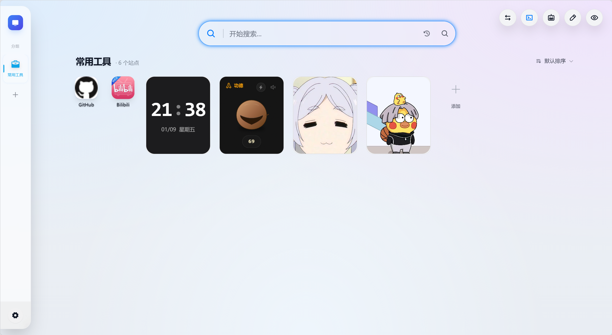
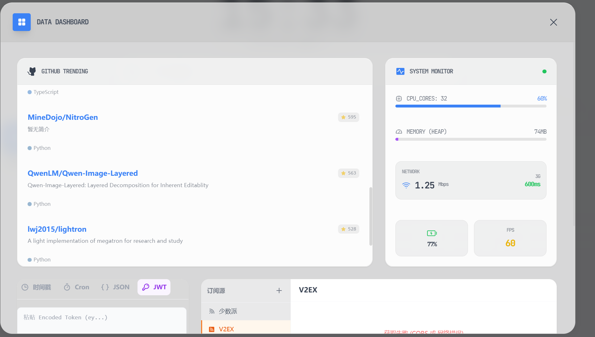
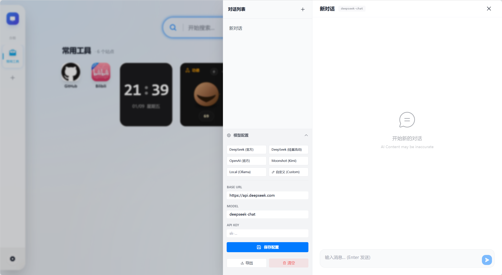
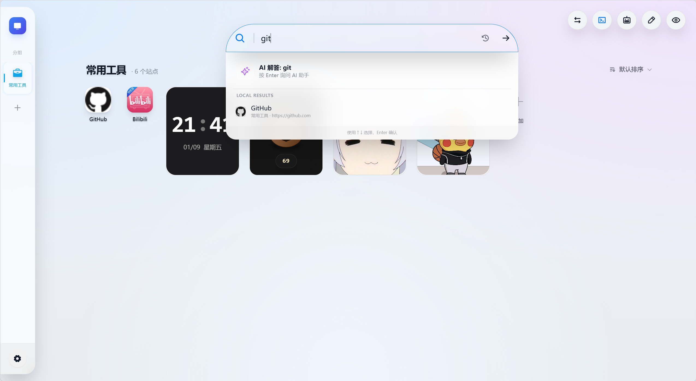

# 🌌 VoidTab - Cyberpunk Browser Dashboard


**VoidTab** 是一个基于 **Vue 3 + TypeScript** 构建的极简、赛博朋克风格浏览器起始页（New Tab Extension）。

它摒弃了传统导航页的臃肿与广告，专注于**极致的视觉体验**与**纯粹的效率**。拥有高度定制化的毛玻璃 UI、沉浸式的数据控制台（HUD）以及支持多端同步的数据存储。



> 🤖 **Fun Fact:** 本项目 99% 的代码由 AI (Google Gemini) 辅助编写，是一个探索 AI 辅助独立开发的实验性项目。

---

## ✨ 功能特性 (Features)

### 🎨 极致视觉
* **毛玻璃拟态 (Glassmorphism)**：全局采用高斯模糊与半透明设计，质感细腻。
* **动态主题**：支持浅色/深色模式切换，深色模式下拥有独特的赛博霓虹光效。
* **自定义壁纸**：支持配置网络图片链接或上传本地视频/图片作为背景。


### 🕹️ 战术控制台 (Data HUD)
通过右上角按钮（或快捷键）呼出沉浸式仪表盘：
* **🌤️ 天气气象站**：自动定位，提供实时温度、湿度、风速及未来 7 天预报，内置中国农历与宜忌查询。
* **📈 GitHub 趋势**：实时获取 GitHub 热门开源项目，展示 Star 数与语言分布，点击直达。
* **🖥️ 系统监控**：浏览器级硬件监控，实时显示 FPS、CPU 核心数、内存占用估算及网络延迟。
* **📰 RSS 聚合 & 🛠️ 开发工具**：(v2.0新增) 支持自定义 RSS 订阅源阅读及时间戳/Cron/JSON 转换工具。




### ⚡ 高效交互与同步
* **☁️ 无感同步 (Zero-Config Sync)**：利用浏览器原生账号系统（Chrome/Edge Sync），自动在不同设备间同步你的壁纸、图标和设置，无需额外注册。
* **专注模式 (Focus Mode)**：一键隐藏所有杂项，仅保留时间与搜索框，提供极致的沉浸式体验。
* **流式布局**：精心调教的 Flex/Grid 布局，支持组件尺寸自定义（1x/2x/Full），完美融合。
* **本地优先**：隐私至上，所有数据存储于用户浏览器本地或加密同步云端，无第三方后台。

---

## 🚀 安装与使用 (Installation)

本项目支持两种运行模式：**浏览器插件模式**（推荐）和 **网页开发模式**。

### 方式一：作为浏览器插件安装 (推荐)
想要获得最佳体验（包括新标签页接管、跨设备同步），请按此步骤安装：

1.  **克隆并构建**
    ```bash
    git clone [https://github.com/flycodeu/VoidTab.git](https://github.com/flycodeu/VoidTab.git)
    cd voidtab
    npm install
    npm run build
    ```
    *构建完成后，根目录会生成一个 `dist` 文件夹。*

2.  **加载到 Chrome / Edge**
   * 在地址栏输入 `chrome://extensions/` (Chrome) 或 `edge://extensions/` (Edge)。
   * 打开右上角的 **开发者模式 (Developer mode)**。
   * 点击 **加载已解压的扩展程序 (Load unpacked)**。
   * 选择项目根目录下的 `dist` 文件夹。
   * 打开一个新的标签页，即可体验 VoidTab。

### 方式二：本地网页开发
如果你想贡献代码或调试 UI：

1.  **启动开发服务器**
    ```bash
    npm run dev
    ```
2.  **访问预览**
    浏览器访问 `http://localhost:5173` 即可看到效果。
    *(注：网页模式下无法测试 Chrome Storage 同步及部分跨域 API 功能)*。

---

## 🖼️ 截图预览 (Gallery)

| 设置面板 | 分组管理 | 编辑模式 |
| :---: | :---: | :---: |
|  |  |  |

---

## 🛠️ 技术栈 (Tech Stack)

* **Core**: Vue 3 (Composition API)
* **Build**: Vite 5.x
* **Extension**: Manifest V3 + Chrome Storage API
* **Language**: TypeScript
* **Styling**: Tailwind CSS
* **State**: Pinia
* **Icons**: Phosphor Icons
* **Utils**: VueUse, Lunar-javascript

---

## 📂 项目结构

```text
├── src
│   ├── assets
│   │   └── (存放图片、视频等资源)
│   ├── components
│   │   ├── layout
│   │   │   ├── AddCard.vue
│   │   │   ├── GlassCard.vue
│   │   │   ├── HomeMain.vue
│   │   │   ├── MainGrid.vue
│   │   │   ├── MobileGroupNav.vue
│   │   │   ├── SideBar.vue
│   │   │   ├── SiteIcon.vue
│   │   │   ├── TopActions.vue
│   │   │   ├── WallpaperLayer.vue
│   │   │   ├── WidgetPanel.vue
│   │   │   ├── settings
│   │   │   │   ├── DataTab.vue
│   │   │   │   ├── EffectsTab.vue
│   │   │   │   ├── IconTab.vue
│   │   │   │   ├── LayoutTab.vue
│   │   │   │   ├── SearchTab.vue
│   │   │   │   ├── SyncTab.vue
│   │   │   │   ├── ThemeTab.vue
│   │   │   │   └── WidgetsTab.vue
│   │   │   ├── sidebar
│   │   │   │   ├── SidebarGroupButton.vue
│   │   │   └── widget-panel
│   │   │       └── WidgetCard.vue
│   │   ├── ui
│   │   │   ├── ConfirmDialog.vue
│   │   │   ├── ConfirmModal.vue
│   │   │   ├── CustomCursor.vue
│   │   │   ├── DeleteConfirmHost.vue
│   │   │   ├── context-menu
│   │   │   │   ├── ContextMenu.vue
│   │   │   │   ├── ContextMenuPanel.vue
│   │   │   │   └── DeleteConfirmModal.vue
│   │   │   └── dialogs
│   │   │       ├── ColorPicker.vue
│   │   │       ├── GroupDialog.vue
│   │   │       ├── GroupDialogForm.vue
│   │   │       ├── IconPicker.vue
│   │   │       ├── SiteDialog.vue
│   │   │       └── SiteDialogForm.vue
│   │   └── widgets
│   │       ├── GitHubTrendsWidget.vue
│   │       ├── GreetingWidget.vue
│   │       ├── RSSWidget.vue
│   │       ├── SearchBar.vue
│   │       ├── SystemWidget.vue
│   │       ├── TimeWidget.vue
│   │       └── WeatherWidget.vue
│   ├── composables
│   │   ├── useAutoIcon.ts
│   │   ├── useDebouncedFavicon.ts
│   │   ├── useDeleteConfirm.ts
│   │   ├── useDialogs.ts
│   │   ├── useGridLayout.ts
│   │   ├── useSidebarDragHandlers.ts
│   │   ├── useTheme.ts
│   │   └── useVisibleGroups.ts
│   ├── core
│   │   ├── config
│   │   │   ├── default.ts
│   │   │   ├── keys.ts
│   │   │   ├── migrate.ts
│   │   │   ├── normalize.ts
│   │   │   ├── repository.ts
│   │   │   ├── types.ts
│   │   │   └── watch.ts
│   │   ├── registry
│   │   │   └── groupIcons.ts
│   │   ├── storage
│   │   │   ├── index.ts
│   │   │   ├── types.ts
│   │   │   └── adapters
│   │   │       ├── chrome.ts
│   │   │       ├── createStorage.ts
│   │   │       └── web.ts
│   │   ├── sync
│   │   │   ├── index.ts
│   │   │   ├── registry.ts
│   │   │   ├── scheduler.ts
│   │   │   ├── service.ts
│   │   │   ├── transport.ts
│   │   │   └── types.ts
│   │   ├── theme
│   │   │   └── wallpaperRepository.ts
│   │   ├── widget
│   │   │   └── providers
│   │   │       ├── base.ts
│   │   │       └── webdav.ts
│   ├── stores
│   │   ├── useConfigStore.ts
│   │   └── useUiStore.ts
│   ├── types
│   │   ├── index.ts
│   │   └── lunnar.d.ts
│   ├── utils
│   │   ├── bookmarkImporter.ts
│   │   ├── icon.ts
│   │   ├── initials.ts
│   │   └── storage.ts
│   ├── App.vue
│   ├── background.ts
│   ├── main.ts
│   ├── style.css
│   └── vite-env.d.ts

```
❤️ 致谢
感谢 Google Gemini 提供强大的代码生成与重构支持。

感谢 Open-Meteo 提供免费且无需 Key 的天气 API 服务。
