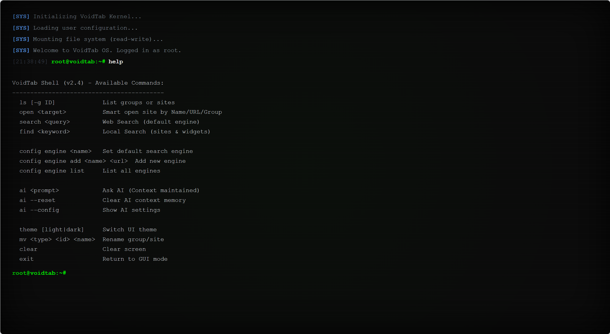
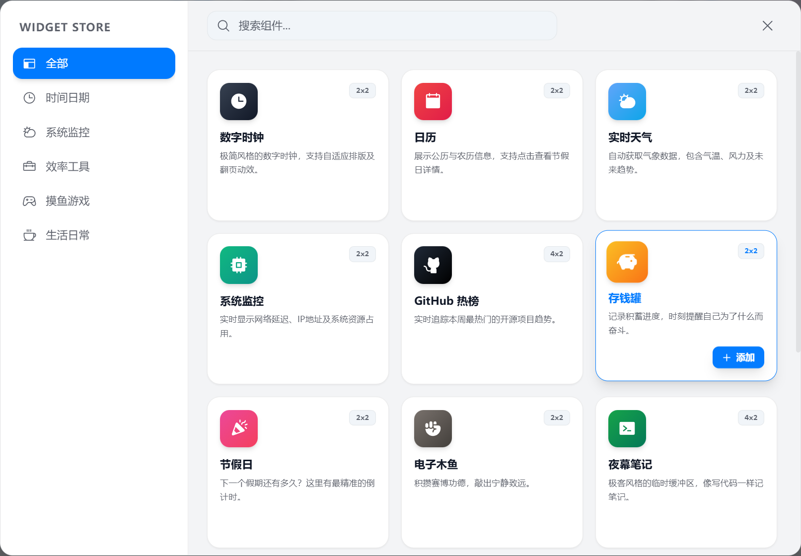

# VoidTab

VoidTab 是一个基于 Vue 3 + TypeScript 构建的极简、赛博朋克风格浏览器起始页（New Tab Extension）。

它摒弃了传统导航页的臃肿与广告，专注于极致的视觉体验与纯粹的效率。拥有高度定制化的毛玻璃 UI、沉浸式的数据控制台（HUD）、**
双模切换（GUI/CLI）**以及支持多端同步的数据存储。

> Fun Fact: 本项目 99% 的代码由 AI (Google Gemini, ChatGPT) 辅助编写，是一个探索 AI 辅助独立开发的实验性项目。

## 功能特性 (Features)

### 极致视觉

- **毛玻璃拟态** ：全局采用高斯模糊与半透明设计，质感细腻。
- **动态主题**：支持浅色/深色模式切换，深色模式下拥有独特的赛博霓虹光效。
- **自定义壁纸**：支持配置网络图片链接、必应每日壁纸，或上传本地视频/图片作为背景。
- **自定义布局**：支持左侧边栏/右侧边栏布局一键切换。

### 命令行终端

专为开发者与极客打造的双模体验：

- **GUI/CLI 热切换**：在图形化界面与纯命令行模式之间无缝切换。
- **沉浸式终端**：全屏 CRT 风格终端，支持命令输入、历史记录与自动补全。
- **黑客体验**：像操作 Linux 终端一样控制你的浏览器起始页，效率与格调并存。


### 丰富的组件生态

内置多样化的小组件，满足各种场景需求：

- 时间/倒计时：支持标准时钟、倒计时组件、Cron 表达式解析器。
- 日历与节假日：日历组件支持节假日显示，还有专门的倒数日组件。
- 天气气象站：自动定位，提供实时温度、湿度、风速及未来 7 天预报，内置中国农历与宜忌查询。
- 效率与监控：系统监控（FPS/CPU/内存）、GitHub 趋势榜、股票行情（Stock Ticker）。
- 娱乐与放松：贪吃蛇游戏、电子木鱼（Wooden Fish）、幸存者游戏、照片墙。
- 开发者工具：JWT 解析工具、终端模拟器（Terminal Buffer）。

### AI 智能助手

集成 AI 对话面板，随时随地辅助你的工作与学习。

- **智能对话**：内置 AI 聊天面板，支持上下文交互。
- **便捷呼出**：通过侧边栏或快捷键快速唤起。

### 高效交互与同步

- WebDAV 同步：支持坚果云、Nextcloud 等 WebDAV 协议网盘，实现跨设备、跨浏览器的数据全量同步。
- **书签导入**：支持从 Chrome/Edge 导出的 HTML 书签文件一键导入，自动解析文件夹为分组。
- **拖拽管理**：支持分组排序、图标跨分组拖拽，完全自定义你的工作台。
- **聚合搜索**：内置多种搜索引擎（Google, Bing, Baidu 等），支持自定义添加，并带有搜索历史记录。
- **专注模式**：一键隐藏所有杂项，仅保留时间与搜索框，提供极致的沉浸式体验。
- **右键菜单**：全局自定义右键菜单，提供便捷的操作入口。


- 
## 安装与使用

本项目支持两种运行模式：浏览器插件模式（推荐）和 网页开发模式。

### 方式一：作为浏览器插件安装 (推荐)

想要获得最佳体验（包括新标签页接管、跨设备同步），请按此步骤安装：

- 克隆并构建

```Bash
git clone https://github.com/flycodeu/VoidTab.git
cd VoidTab
npm install
npm run build
```

构建完成后，根目录会生成一个 dist 文件夹。

### 加载到 Chrome / Edge

- 在地址栏输入 chrome://extensions/ (Chrome) 或 edge://extensions/ (Edge)。
- 打开右上角的 开发者模式 (Developer mode)。
- 点击加载已解压的扩展程序 (Load unpacked)。
- 选择项目根目录下的 dist 文件夹。
- 打开一个新的标签页，即可体验 VoidTab。

### 方式二：本地网页开发如果你想贡献代码或调试

- UI：启动开发服务器

```Bash
npm run dev
```

- 访问预览
  浏览器访问 http://localhost:5173 即可看到效果。(注：网页模式下无法测试 Chrome Storage 同步及部分跨域 API 功能)。

## 二次开发指南 (Development Guide)

VoidTab 采用了模块化架构，逻辑层与视图层分离，方便扩展。

### 1. 核心架构说明

- View Layer (src/components): 负责 UI 展示。
- app/shell/: 应用外壳层，包含壁纸等全局背景元素。
- features/: 按功能模块划分的组件集。
    - home/: 首页核心布局（网格、卡片）。
    - widgets/: 所有内置小组件的具体实现。
    - settings/: 设置面板及各配置 Tab。
    - terminal/: 命令行终端模式实现逻辑。
    - ai/: AI 聊天功能模块。
    - navigation/: 侧边栏及顶部导航。
- shared/: 通用 UI 组件库（Dialog, Overlay, Icons）。

### 2. Logic Layer (src/core): 核心业务逻辑，不依赖具体 UI。

- config/: 配置管理、默认配置、迁移逻辑。
- registry/: 组件与图标注册中心。
- storage/: 存储适配器（IndexedDB, LocalStorage, Chrome Storage）。
- sync/: WebDAV 同步服务的核心实现。
- State Management (src/stores): 使用 Pinia 管理全局响应式状态。

### 2. 如何添加一个新的小组件 (Widget)?

假设你要添加一个“待办事项”组件：

- 创建组件目录: 在 src/features/widgets/builtins/ 下新建 todo 目录。
- 编写组件: 创建 TodoWidget.vue 和可选的配置模态框 TodoModal.vue。
- 注册组件:
    - 在 src/core/registry/widgets.ts 中注册新组件的元数据（ID、名称、图标等）。
    - 在 src/features/widgets/components/WidgetCard.vue 或相应的渲染逻辑中引入组件。
    - 确保在 src/core/config/types.ts 定义相关的数据类型。

## 技术栈 (Tech Stack)

- Core: Vue 3 (Composition API)
- Build: Vite 5.x
- Extension: Manifest V3 + Chrome Storage API
- Language: TypeScript
- Styling: Tailwind CSS
- State: Pinia
- Icons: Phosphor Icons
- Utils: VueUse, Lunar-javascript
- Network: Fetch API (WebDAV)
- Database: IndexedDB (用于存储历史记录和大型数据)

## 项目结构Plaintextsrc

```
    ├── App.vue
    ├── background.ts           # 扩展后台脚本
    ├── main.ts                 # 入口文件
    ├── style.css               # 全局样式
    ├── vite-env.d.ts
    ├── app
    │   └── shell               # 应用壳层 (WallpaperLayer)
    ├── core                    # 核心逻辑
    │   ├── config              # 配置与迁移
    │   ├── registry            # 组件注册
    │   ├── storage             # 存储适配 (IndexedDB/Chrome)
    │   ├── sync                # 同步引擎
    │   ├── system              # 系统状态
    │   └── theme               # 主题逻辑
    ├── features                # 功能模块
    │   ├── ai                  # AI 聊天
    │   ├── confirm-delete      # 删除确认
    │   ├── context-menu        # 右键菜单
    │   ├── home                # 首页布局
    │   ├── navigation          # 导航栏
    │   ├── settings            # 设置面板
    │   ├── terminal            # 命令行终端模式 (Terminal Mode)
    │   └── widgets             # 小组件集 (builtins/)
    ├── shared                  # 共享资源
    │   ├── composables         # 组合式函数
    │   ├── constants           # 常量
    │   ├── icons               # 图标组件
    │   ├── types               # 类型定义
    │   ├── ui                  # 通用 UI 组件
    │   └── utils               # 工具函数
    └── stores                  # Pinia 状态库
```

## 致谢 (Credits)
- 感谢 Google Gemini 、ChatGPT 提供强大的代码生成与重构支持。
- 感谢 Open-Meteo 提供免费且无需 Key 的天气 API 服务。
- 感谢 Phosphor Icons 提供精美的图标库。